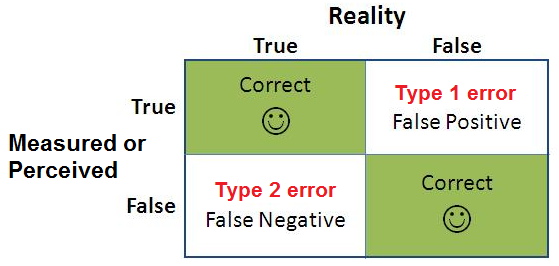

If I test positive for HIV during my regular semi-annual STI screenings (that I get cause I'm a responsible adult), what are the odds I actually have HIV?

About 50%—wait a second! Isn't the whole point of tests that they're definitive?

To answer why that's not the case we have to take a quick detour through the concept of Information.

There's two possible realities: either I have HIV or I don't. But because All Stimuli are Ambiguous, tests have FOUR possibilities, two of which are right and two are errors:

1. I have HIV and the test correctly identifies I have HIV (true positive).
2. I don't have HIV and the test correctly identifies I don't have HIV (true negative).
3. I have HIV but the test says I don't ("miss" or "false negative").
4. I don't have HIV and the test says I do ("false positive").

So how did I come up with that 50% figure? It's a pretty simple calculation, actually for you to try:

"About 0.01 percent of men in Germany with no known risk behavior are infected with HIV (base rate). If such a man has the virus, there is a 99.9 percent chance that the test result will be positive (sensitivity). If a man is not infected, there is a 99.99 percent chance that the test result will be negative (specificity)."

Take a stab at it. Just guess an answer, if you'd like, before you continue.

Okay, I lied. It's not a simple calculation. You need Bayes' Rule to solve it, which is P(A|B) = P(B|A)*P(A) / P(B). I had to look it up.

But by thinking about these things in terms of Natural Frequencies, you can do Bayesian calculations in your head (with practice):

"Imagine 10,000 men who are in low-risk category. One is infected (base rate) and will test positive with practical certainty (true positive). Of the 9,999 men who are not infected, another one will also test positive (false positive). What is the false-positive rate?"

Now try to figure it out. I'll wait.

I assume you can add 1 + 1 and then divide 1 from 2, but the answer is I have a 50-50 chance of my positive test actually being a true positive.

Another way to think about it is using a tree diagram like this:

That said, this is one of the reasons they do multiple HIV tests, with different sensitivity and specificity ratings. And when—not if, due to the high false-positive rate—I get a positive HIV, I'll be getting a second one.

I've taken to looking up (on Google Scholar) or asking doctors what the miss (sensitivity) and false positive rates (specificity) for tests are, because they vary widely and I need to understand them to be an educated, informed consumer of medical information and tests.

NEXT TIME ON AMMAR'S BORING AF PROBABILITY SERIES: How to think about COVID-19 testing and mortality rates.

PS Generally, signal ("true" results) and noise ("false" results) trade off of each other. For a test to make sure it doesn't miss any true positives, it'll likely have a higher false positive rate. If you want to reduce the false positive rate, you'll increase the miss rate. So, tests usually choose which side they want to err on.

"The first [HIV] test, called the ELISA (enzyme-linked immunoabsorbent assay), is designed to detect antibodies against HIV in blood samples. It was originally used to screen donated blood, where maximizing test sensitivity (the true positive rate)—at the cost of an increased false positive rate—was imperative."