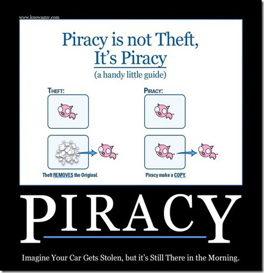

# Replicators won't end money and bring about post-scarcity (Take 2)

To understand why we simply need to think through this meme consistently:

That's called [Rivalry](https://en.wikipedia.org/wiki/Rivalry_(economics)), so a car is Rivalrous--people are rivals for driving it--while a digital file is Non-Rivalrous. (Anti-Rival Goods)[https://en.wikipedia.org/wiki/Anti-rival_good] have [Network Effects](https://en.wikipedia.org/wiki/Network_effect) which can lead to [Natural Monopolies](https://en.wikipedia.org/wiki/Natural_monopoly).

Let's add a second dimension called [Excludability](https://en.wikipedia.org/wiki/Excludability), which refers to how easy it is to limit a good/service to a relevant group eg paying customers. Example: Your romantic love or parenting are easy to Exclude those you don't judge worthy. While both over-the-air (OTA) TV and cable TV are Non-Rivalrous (ie my neighbour and I can both be watching the same thing at the same time), OTA TV is Non-Excludable, while cable is Excludable.

Now we can make a 2 x 2 matrix:

|               | Excludable    | Non-Excludable
| ------------- | ------------- | ------------
| Rivalrous     | Private Goods | Common-Pool Resources
| Non-Rivalrous | Club Goods    | Public Goods

> Private Goods include food, clothing, parking spaces, etc.
> 
> Common-Pool Resources including fish stocks, timber, coal, etc.
> 
> Club Goods include cinemas, gyms, satellite/cable TV, public transport, etc.
> 
> Public Goods include this essay, over-the-air TV, open-source software, roads, national defense (or fire services, if you want something less martial--your neighbour can't get fire protection while you do), etc.

